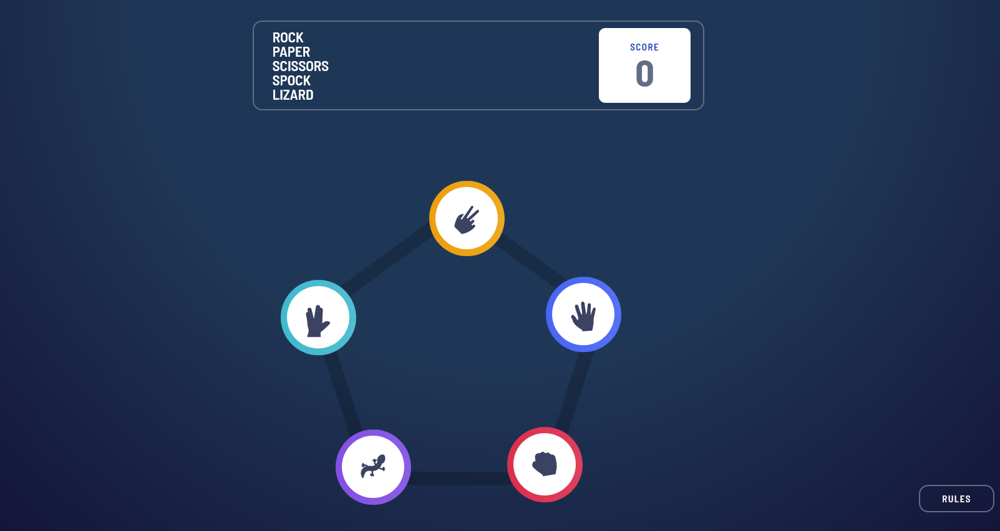
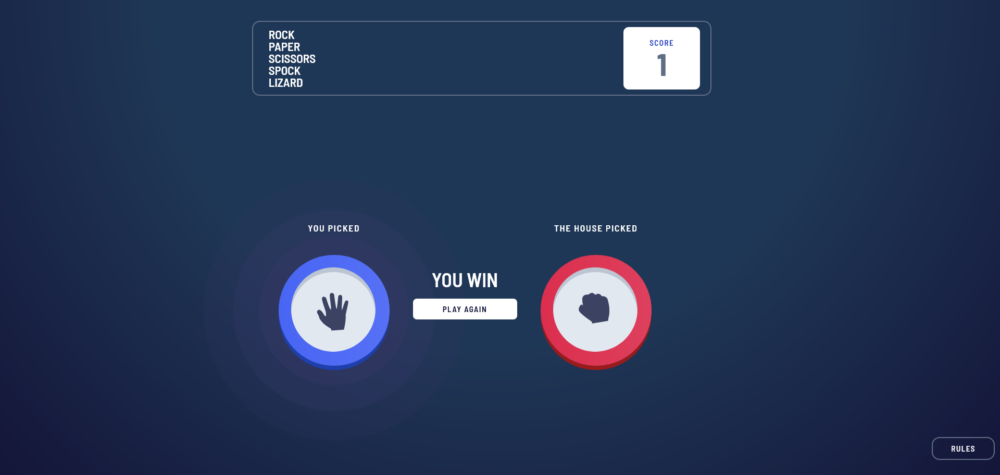

# Frontend Mentor - Rock, Paper, Scissors solution

This is a solution to the [Rock, Paper, Scissors challenge on Frontend Mentor](https://www.frontendmentor.io/challenges/rock-paper-scissors-game-pTgwgvgH). Frontend Mentor challenges help you improve your coding skills by building realistic projects. 

## Table of contents

- [Overview](#overview)
  - [Screenshot](#screenshot)
  - [Links](#links)
- [My process](#my-process)
  - [Built with](#built-with)
  - [What I learned](#what-i-learned)
- [Author](#author)
- [Acknowledgments](#acknowledgments)

## Overview

### Screenshot

Add a screenshot of your solution. The easiest way to do this is to use Firefox to view your project, right-click the page and select "Take a Screenshot". You can choose either a full-height screenshot or a cropped one based on how long the page is. If it's very long, it might be best to crop it.

Alternatively, you can use a tool like [FireShot](https://getfireshot.com/) to take the screenshot. FireShot has a free option, so you don't need to purchase it. 

Then crop/optimize/edit your image however you like, add it to your project, and update the file path in the image above.

**Note: Delete this note and the paragraphs above when you add your screenshot. If you prefer not to add a screenshot, feel free to remove this entire section.**

### Links

- Solution URL: [https://65a840db49068a0d7469b654--inspiring-liger-9e6fd5.netlify.app/](https://65a840db49068a0d7469b654--inspiring-liger-9e6fd5.netlify.app/)
- Live Site URL: [https://github.com/Phoenix9110/rock-paper-scissors](https://github.com/Phoenix9110/rock-paper-scissors)

## My process

### Built with

- Semantic HTML5 markup
- CSS custom properties (Flexbox, Grid)
- [React](https://reactjs.org/) - JS library
- [Astro](https://astro.build/) - Agnostic framework
- [Tailwind](https://tailwindcss.com/) - For styles
- [Zustand](https://zustand-demo.pmnd.rs/) - -For ate state management

### What I learned

I started the challenge of replicating the rock paper scissors game in order to practice a little tailwind, and learn the use of Astro with zustand, I was surprised by the impact on performance when performing the application with Astro, and the use of zustand to manage the state was particularly easy, I can't wait to do another project with the same stack.

## Author

- Frontend Mentor - [@Phoenix9110](https://www.frontendmentor.io/profile/Phoenix9110)

## Acknowledgments

To Rebel Chris and his very usefull Modal Component in Astro (https://github.com/rebelchris/astro-modal)